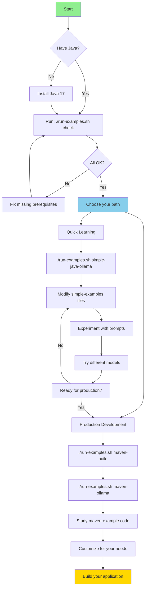

# JVM Examples for GenAI

Production-ready Java and Kotlin examples for interacting with local LLM servers (Ollama and LM Studio).

## 🚀 Quick Start

**Fastest way to get started:**

```bash
# Check prerequisites
./run-examples.sh check

# Run a simple example
./run-examples.sh simple-java-ollama
```

See [QUICK_START.md](QUICK_START.md) for detailed getting started guide.

## 📁 Project Structure

```
day-1/JVM/
├── 🎯 run-examples.sh          # One-command runner (Linux/macOS)
├── 🎯 run-examples.bat         # One-command runner (Windows)
├── 📖 QUICK_START.md           # Get started in 5 minutes
├── 📖 README.md                # This file
│
├── 📂 simple-examples/         # Zero-dependency examples
│   ├── README.md               # Simple examples guide
│   ├── GettingStartedOllama.java      # ⚡ Fastest: Java + Ollama
│   ├── GettingStartedOllama.kt        # Kotlin + Ollama
│   ├── GettingStartedLmStudio.java    # Java + LM Studio
│   └── GettingStartedLmStudio.kt      # Kotlin + LM Studio
│
├── 📂 maven-example/           # Production-ready Maven project
│   ├── README.md               # Maven project guide
│   ├── pom.xml                 # Maven configuration
│   └── src/main/java/com/example/
│       ├── OllamaClient.java   # 🏗️ Production: Ollama client
│       └── LmStudioClient.java # LM Studio client
│
└── 📂 gradle-example/          # Production-ready Gradle project
    ├── README.md               # Gradle project guide
    ├── build.gradle.kts        # Gradle configuration (Kotlin DSL)
    ├── gradlew                 # Gradle wrapper (Linux/macOS)
    ├── gradlew.bat             # Gradle wrapper (Windows)
    └── src/main/java/com/example/
        ├── OllamaClient.java   # 🏗️ Production: Ollama client
        └── LmStudioClient.java # LM Studio client
```

## 🎯 Three Approaches

### Simple Examples (Zero Dependencies)
- ✅ **Instant setup** - Just Java, no build tools
- ✅ **Perfect for learning** - Easy to understand code
- ✅ **Quick experiments** - Modify and run immediately
- ✅ **Minimal code** - Uses only standard library

**Best for:** Quick experiments, learning, demos

### Maven Examples (Production-Ready)
- ✅ **Modern libraries** - OkHttp + Gson
- ✅ **Proper structure** - Maven project layout
- ✅ **Easy dependency management** - Add libraries easily
- ✅ **Production patterns** - Clean, maintainable code
- ✅ **Industry standard** - Widely used in enterprise

**Best for:** Enterprise applications, traditional Java shops

### Gradle Examples (Production-Ready)
- ✅ **Modern libraries** - OkHttp + Gson
- ✅ **Kotlin DSL** - Type-safe build configuration
- ✅ **Faster builds** - Incremental compilation and caching
- ✅ **Flexible** - Programmatic build scripts
- ✅ **Modern tooling** - Better IDE support

**Best for:** New projects, Android development, modern Java apps

## 📋 Available Commands

### Using the Runner Script

```bash
# Simple examples (no build tools needed)
./run-examples.sh simple-java-ollama        # Fastest start
./run-examples.sh simple-java-lmstudio
./run-examples.sh simple-kotlin-ollama      # Requires Kotlin
./run-examples.sh simple-kotlin-lmstudio

# Maven examples (production-ready)
./run-examples.sh maven-build               # First time setup
./run-examples.sh maven-ollama
./run-examples.sh maven-lmstudio
./run-examples.sh maven-package             # Create JAR

# Gradle examples (production-ready)
./run-examples.sh gradle-build              # First time setup
./run-examples.sh gradle-ollama
./run-examples.sh gradle-lmstudio
./run-examples.sh gradle-package            # Create JAR

# Utilities
./run-examples.sh check                     # Check prerequisites
./run-examples.sh help                      # Show all options
```

### Manual Commands

#### Simple Java (No Maven Required)
```bash
cd simple-examples

# Compile and run Ollama example
javac GettingStartedOllama.java && java GettingStartedOllama

# Compile and run LM Studio example
javac GettingStartedLmStudio.java && java GettingStartedLmStudio
```

#### Simple Kotlin (Kotlin Compiler Required)
```bash
cd simple-examples

# Compile and run Ollama example
kotlinc GettingStartedOllama.kt -include-runtime -d ollama.jar
java -jar ollama.jar

# Compile and run LM Studio example
kotlinc GettingStartedLmStudio.kt -include-runtime -d lmstudio.jar
java -jar lmstudio.jar
```

#### Maven Project
```bash
cd maven-example

# Build
mvn clean compile

# Run with profiles
mvn exec:java -Pollama
mvn exec:java -Plmstudio

# Or run specific class
mvn exec:java -Dexec.mainClass="com.example.OllamaClient"

# Create executable JAR
mvn clean package
java -jar target/genai-clients-1.0.0.jar
```

#### Gradle Project
```bash
cd gradle-example

# Build
./gradlew build

# Run with custom tasks
./gradlew runOllama
./gradlew runLmStudio

# Or use default run task
./gradlew run

# Create executable JAR
./gradlew clean jar
java -jar build/libs/gradle-example-1.0.0.jar
```

## 🔧 Prerequisites

### Required
- **Java 11+** (Java 17+ recommended)
  ```bash
  java -version  # Check version
  ```

### Optional (depending on which examples you want to run)
- **Maven 3.6+** (for Maven examples)
  ```bash
  mvn -version  # Check version
  ```
- **Gradle 8.0+** (for Gradle examples - wrapper included)
  ```bash
  ./gradlew --version  # Check version
  ```
- **Kotlin compiler** (for Kotlin examples)
  ```bash
  kotlinc -version  # Check version
  ```

### Servers (REQUIRED)

⚠️ **CRITICAL:** One of these servers MUST be running before executing examples!

- **Ollama** running on `localhost:11434`
  ```bash
  # Start the server
  ollama serve
  
  # Pull a model
  ollama pull qwen3
  
  # Verify server is running
  curl http://localhost:11434/api/tags
  ```

- **LM Studio** running on `localhost:1234`
  1. Open LM Studio application
  2. Download and load a model (e.g., qwen3-4b-mlx)
  3. Go to "Local Server" or "Server" tab
  4. Click "Start Server" button
  5. Verify server is running:
     ```bash
     curl http://localhost:1234/v1/models
     ```

💡 **Without a running server, you'll get connection errors!**

## 🎓 Learning Path



## 💡 Key Features Comparison

| Feature | Simple Examples | Maven Examples | Gradle Examples |
|---------|----------------|----------------|----------------|
| **Setup Time** | 0 minutes | 2 minutes | 2 minutes |
| **Dependencies** | None | OkHttp, Gson | OkHttp, Gson |
| **Build Tool** | None | Maven | Gradle |
| **Build Speed** | N/A | Good | Faster |
| **Code Lines** | ~100 | ~50 | ~50 |
| **HTTP Client** | Java stdlib | OkHttp | OkHttp |
| **JSON Parsing** | Manual | Gson | Gson |
| **Package Management** | N/A | Maven | Gradle |
| **Build Cache** | N/A | No | Yes |
| **Production Ready** | No | Yes | Yes |
| **Maintainability** | Basic | High | High |
| **Best For** | Learning | Enterprise | Modern Apps |

## 🔄 Example Workflow

### Quick Experiment
```bash
# 1. Start Ollama
ollama serve

# 2. Pull a model
ollama pull qwen3

# 3. Run example
./run-examples.sh simple-java-ollama

# 4. Modify prompt in simple-examples/GettingStartedOllama.java
# 5. Run again
```

### Production Development
```bash
# 1. Build Maven project
./run-examples.sh maven-build

# 2. Test with Ollama
./run-examples.sh maven-ollama

# 3. Customize code in maven-example/src/
# 4. Rebuild and test
cd maven-example && mvn clean compile && mvn exec:java -Pollama

# 5. Package for deployment
mvn clean package
```

## 🆘 Troubleshooting

### "Connection refused" or "Failed to connect to localhost"
**Problem:** Can't connect to server

**Root Cause:** This is the #1 most common error - the server is not running!

**Solution:**

**For Ollama:**
```bash
# Check if Ollama is running
curl http://localhost:11434/api/tags

# If you get an error, start Ollama:
ollama serve

# In another terminal, pull a model:
ollama pull qwen3
```

**For LM Studio:**
```bash
# Check if LM Studio server is running
curl http://localhost:1234/v1/models

# If you get an error:
# 1. Open LM Studio application
# 2. Go to "Local Server" tab
# 3. Click "Start Server" button
# 4. Ensure a model is loaded
```

⚠️ **The server must be running BEFORE you execute any examples!**

### "Model not found"
**Problem:** Server doesn't have the model

**Solution:**
```bash
# For Ollama
ollama pull qwen3
ollama list  # Show available models

# For LM Studio
# Download model in the UI, check name in "Server" tab
```

### "javac: command not found"
**Problem:** Java compiler not installed

**Solution:**
```bash
# macOS
brew install openjdk@17
export PATH="/opt/homebrew/opt/openjdk@17/bin:$PATH"

# Ubuntu/Debian
sudo apt update
sudo apt install openjdk-17-jdk

# Windows
choco install openjdk17
```

### "mvn: command not found"
**Problem:** Maven not installed (only needed for Maven examples)

**Solution:**
```bash
# macOS
brew install maven

# Ubuntu/Debian
sudo apt install maven

# Windows
choco install maven
```

### "kotlinc: command not found"
**Problem:** Kotlin compiler not installed (only needed for Kotlin examples)

**Solution:**
```bash
# macOS
brew install kotlin

# Ubuntu/Debian
sudo snap install kotlin --classic

# Windows
choco install kotlin
```

## 📚 Documentation

- **[QUICK_START.md](QUICK_START.md)** - Get started in 5 minutes
- **[IDE_SETUP.md](IDE_SETUP.md)** - Run examples in IntelliJ, Eclipse, VS Code, or NetBeans
- **[simple-examples/README.md](simple-examples/README.md)** - Detailed guide for simple examples
- **[maven-example/README.md](maven-example/README.md)** - Comprehensive Maven project guide

## 🎯 Example Use Cases

### Quick Script
Use **simple-examples** to:
- Test if Ollama/LM Studio is working
- Experiment with different prompts
- Try different models
- Learn how the APIs work
- Create quick demos

### Production Application
Use **maven-example** as base for:
- Chat applications
- Code generation tools
- Document processing pipelines
- Content generation systems
- AI-powered automation
- Integration with existing Java apps

## 🔧 Customization Examples

### Change Model
```java
// Simple examples
String jsonString = "{\"model\":\"llama2\",\"prompt\":\"Hello\",\"stream\":false}";

// Maven examples
requestJson.addProperty("model", "llama2");
```

### Change Prompt
```java
// Simple examples
String jsonString = "{\"model\":\"qwen3\",\"prompt\":\"Tell me a joke\",\"stream\":false}";

// Maven examples
requestJson.addProperty("prompt", "Tell me a joke");
```

### Add Parameters
```java
// Maven examples - easy with Gson
requestJson.addProperty("temperature", 0.8);
requestJson.addProperty("top_p", 0.9);
requestJson.addProperty("max_tokens", 100);
```

### Enable Streaming
```java
// Maven examples
requestJson.addProperty("stream", true);

// Then handle streamed response
try (BufferedReader reader = new BufferedReader(
        new InputStreamReader(response.body().byteStream()))) {
    String line;
    while ((line = reader.readLine()) != null) {
        // Process each chunk
    }
}
```

## 🚀 Next Steps

1. **Run the check:** `./run-examples.sh check`
2. **Try simple example:** `./run-examples.sh simple-java-ollama`
3. **Read the code:** Open and study the simple examples
4. **Experiment:** Modify prompts and models
5. **Go production:** Build the Maven project
6. **Customize:** Use as base for your application

## 📖 Additional Resources

- [Ollama API Documentation](https://github.com/ollama/ollama/blob/main/docs/api.md)
- [LM Studio Documentation](https://lmstudio.ai/docs)
- [OkHttp Documentation](https://square.github.io/okhttp/)
- [Gson Documentation](https://github.com/google/gson)
- [Maven Getting Started](https://maven.apache.org/guides/getting-started/)

## 🤝 Contributing

Feel free to:
- Add more examples
- Improve documentation
- Report issues
- Suggest features

## 📄 License

MIT

---

**Ready to start?** Run `./run-examples.sh check` to verify your setup!
